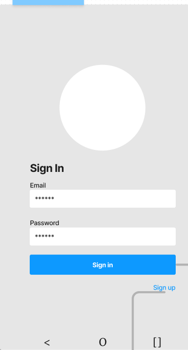
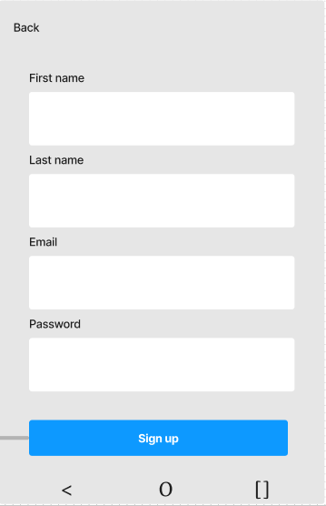
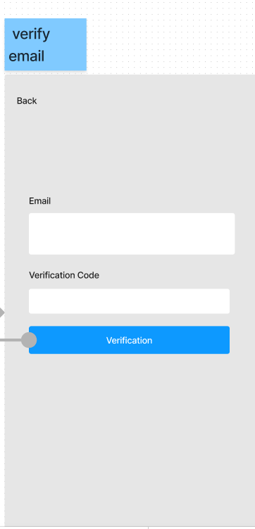

# Subject Planner

## Project Prepration:
**1. [Team Agreement](./Project-Prep/TeamAgreement.md)**

## Overview:
- The Subject Planner app is designed to help students efficiently manage their academic responsibilities and keep track of their academic performance.
 
 - The app includes key features such as subject tracking, grade management, agenda for notes, notifications, and a profile overview. 
 
 - It aims to provide a comprehensive solution for students to organize their academic life in a single, user-friendly platform.
 
 # Wireframes Sequence
# Wireframes Sequence

| Step | Wireframe Name | Wireframe                    |
|------|----------------|------------------------------|
| 1    | Login          |   |
| 2    | Signup         |  |
| 3    | Verify Email   |  |

# User Stories

## User Story 1

**Title:** User Registration  
**User Story Sentence:** As a new user, I want to be able to create an account on the Subject Planner app so that I can start managing my academic responsibilities.  
**Feature Tasks:**
- Implement a user registration page.
- Include fields for username, email, and password.
- Add a confirmation step for email verification.

**Acceptance Tests:**
1. The user should be able to access the registration page.
2. The user should successfully create an account by providing valid information.
3. The user should receive an email for verification after registration.

## User Story 2

**Title:** Adding a New Subject  
**User Story Sentence:** As a student, I want to add a new subject to the app with relevant details like the subject name, course details, and an image to easily identify it.  
**Feature Tasks:**
- Create an interface to add a new subject.
- Include fields for subject name, course details, and the option to upload an image.
- Implement a confirmation message upon successful addition.

**Acceptance Tests:**
1. The user should find a button or section for adding a new subject.
2. The user should input subject details and upload an image successfully.
3. The app should display a confirmation message after adding the subject.

## User Story 3

**Title:** Tracking Grades  
**User Story Sentence:** As a student, I want to input and track my grades for each subject so that I can monitor my academic performance over time.  
**Feature Tasks:**
- Develop a grade input form for each subject.
- Include fields for assignment grades, exam grades, and overall averages.
- Enable the user to update grades over time.

**Acceptance Tests:**
1. The user should find a section for inputting grades for each subject.
2. The user should successfully input assignment and exam grades.
3. The app should accurately calculate and display the overall average grade for each subject.

## User Story 4

**Title:** Setting Reminders  
**User Story Sentence:** As a student, I want to set reminders for upcoming lectures and exams so that I can better manage my study schedule.  
**Feature Tasks:**
- Implement a notification and settings section.
- Allow users to set reminders for specific events like lectures and exams.
- Provide customization options for notification preferences.

**Acceptance Tests:**
1. The user should find a dedicated section for setting reminders.
2. The user should successfully set reminders for lectures and exams.
3. The app should send notifications as per the user's configured preferences.

## User Story 5

**Title:** Profile Overview  
**User Story Sentence:** As a user, I want to view an overview of my information.  
**Feature Tasks:**
- Develop a profile page displaying user information.
- Ensure the information is dynamically updated based on user activity.

**Acceptance Tests:**
1. The user should find a profile section displaying relevant information.
3. User actions (e.g., updating information) should reflect dynamically in the profile overview.

## Project Management Board

You can find the project management board containing these user stories [in our Jira board](https://ricepify.atlassian.net/jira/software/projects/SP/boards/4).

# Software Requirements: 
- You can find the project Software Requirements in our [requirements.md file](/requirements.md).

# Domain Modeling 
- there can be some updates on this as we continue with the project.

Entity: User
- Properties: 
  - userID (String)
  - username (String)
  - email (String)
  - password (String)

Entity: Subject
- Properties:
  - subjectID (String)
  - userID (String, Foreign Key referencing User)
  - name (String)
  - courseDetails (String)
  - image (String)

Entity: Grade
- Properties:
  - gradeID (String)
  - subjectID (String, Foreign Key referencing Subject)
  - assignmentGrade (Float)
  - examGrade (Float)
  - overallAverage (Float)

  # Database Schema Diagram
  

